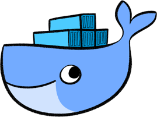

# Проект: Автоматизированное тестирование UI с использованием Playwright и Allure

<p align="center">
  
  
</p>

## Описание

Данный проект представляет собой автоматизированное тестирование главной страницы сайта **effective-mobile.ru.**

## Функциональность:

- Проверка переходов по всем основным разделам страницы (О нас, Контакты и пр.).

- Валидация соответствующих локаторов и URL после переходов.

- Использование паттерна **Page Object Model (POM)** для структурирования тестов.

- Генерация отчетов о выполнении тестов в **Allure**.

- Оптимизированная архитектура для удобства масштабирования и поддержки.

## Технологии

- **Язык**: Python 3.10

- **Фреймворк для тестирования**: pytest

- **Библиотека для UI-тестирования**: Playwright

- **Генерация отчетов**: Allure

- **Контейнеризация**: Docker

----

## Требования
Перед началом работы убедитесь, что на вашей системе установлены:
- **Python 3.10** или выше
- **Docker** и **Docker Compose**

----

## Установка и запуск

### 1. Клонирование репозитория
```bash
git clone https://github.com/ToN1PS/effective_mobile.git
cd effective_mobile
```

### 2. Установка зависимостей
При использовании виртуального окружения (необязательно при запуске через Docker):
```bash
python -m venv venv
source venv/bin/activate  # macOS/Linux
venv\Scripts\activate  # Windows
pip install -r requirements.txt
```

### 3. Запуск тестов
#### Запуск без Docker:
```bash
python -m pytest --alluredir=allure-results
```

#### Запуск в Docker:
1. Запуск Allure backend.
2. Запуск Allure UI.
3. Запуск тестов и передача результатов в Allure backend.
```bash
docker compose up
```

### 4. Просмотр отчетов Allure
#### Доступ к отчету на локальном сервере:
После успешного запуска контейнеров отчет будет доступен в веб-браузере.

🔗 Перейдите по адресу: http://localhost:5252

📌 Важно: Отчет становится доступным только после выполнения команды docker compose up и завершения тестов.

----

## Полезные ссылки
- [Документация Playwright](https://playwright.dev/)
- [Документация pytest](https://docs.pytest.org/)
- [Документация Allure](https://docs.qameta.io/allure/)
- [Документация Docker](https://docs.docker.com/)
